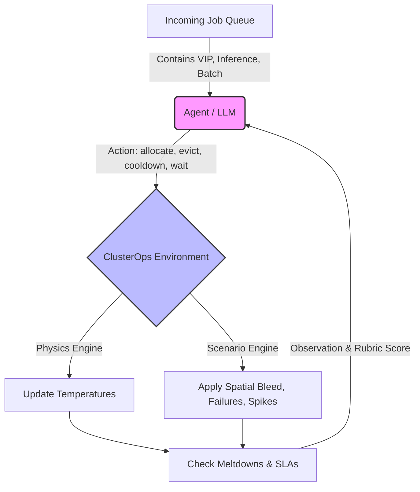

# 🔥 ClusterOps: The Thermal GPU Balancer

### Can an LLM learn thermodynamics?

We gave a language model control of a live GPU data center, incoming job queues, and cooling systems. It had no pre-training on fluid dynamics, no prior knowledge of hardware racks, and no hardcoded scheduling heuristics. Just thermal sensors and a `/step` endpoint.

Within hours of RL training, it learned to pack jobs efficiently. But as we escalated the environment's complexity—introducing **spatial heat bleed**, **heterogeneous hardware**, and **adversarial traffic spikes**—the agent had to evolve. It stopped reacting to temperatures and started *predicting* them. It learned to leave physical gaps between heavy VIP jobs to prevent cascading rack meltdowns. It learned to proactively force-cool idle nodes *before* a predicted DDoS traffic spike.

**This is ClusterOps** — an OpenEnv-compliant RL environment where an agent learns to manage a physical data center through curriculum-driven operational scenarios, adversarial constraints, and composable rubrics.

> **OpenEnv Hackathon 2026** | Built with [OpenEnv v0.2.1](https://github.com/meta-pytorch/OpenEnv)

---

## 📖 The Story: Evolving a World Model

ClusterOps doesn't use simple "Easy/Medium/Hard" modes. Instead, we train the agent through a curriculum of **Operational Scenarios**. To survive, the LLM must build a persistent internal representation of the cluster's physical properties.

### Act 1: The Cold Start (`01_baseline`)
The agent starts with a simple goal: pack jobs onto 10 identical nodes without hitting 100°C. Initially, it blindly assigns jobs until the cluster catches fire. Slowly, it learns the thermal cost of different job types (`vip_training` = +15°C/step) and avoids scheduling heavy jobs on nodes already running hot.

### Act 2: Spatial Awareness (`02_spatial_bleed`)
We change the laws of physics. Now, the nodes exist in a physical array. If `node[3]` hits 85°C, it radiates +3°C to `node[2]` and `node[4]`. A baseline agent fails immediately, creating cascading rack meltdowns. Our trained agent discovers **Spatial Isolation**: it deliberately leaves idle buffer nodes between heavy workloads to dissipate heat.

### Act 3: Semantic Matching (`03_heterogeneous`)
The cluster is upgraded. Half the nodes are fast, hot H100s. Half are slow, cool T4s. The agent must learn to match the semantic priority of the job to the hardware—routing urgent VIP tasks to H100s and slow Batch jobs to T4s, optimizing compute-per-watt.

### Act 4: The Environment Fights Back (`04_maintenance` & `05_adversarial`)
The environment becomes hostile. A scheduled outage threatens to take half the cluster offline. The agent learns **Deadline Evacuation**, draining jobs before the outage hits. Then, the traffic spikes. The queue sits empty, lulling the agent into a false sense of security, before dumping 15 VIP jobs at once. The agent learns **Pre-Cooling**: sacrificing early steps to aggressively force-cool idle nodes, building a thermal buffer *before* the spike arrives.

---

## 🏆 Hackathon Theme Alignment

### Primary: Theme 3.1 — World Modeling & Professional Tasks
ClusterOps directly answers the call for environments requiring persistent internal states and multi-step workflows.
*   **Predictive Physics**: The agent doesn't get a "danger" flag. It must calculate future temperatures from `current_temp + heat_rate` internally.
*   **Causal Reasoning**: To prevent spatial bleed, the agent must model the physical layout of the nodes, not just treat them as an unordered list.

### Anti-Reward Hacking
We use OpenEnv's **Composable Rubric** system to prevent exploitation:
1.  **Thermal Safety (35%)**: Penalizes meltdowns.
2.  **Throughput (30%)**: Rewards job completions.
3.  **Efficiency (20%)**: Massive 3x penalty for "Thrashing" (allocating and immediately evicting jobs to reset timers).
4.  **SLA Compliance (15%)**: Immediate episode termination if the queue saturates (passive stalling).

## 🧠 Training Insights (GRPO + TRL)

### What the agent learned (from the reward signal alone)
1. **Spatial Buffer Zones:** In the `02_spatial_bleed` scenario, the agent stopped packing nodes adjacently. It discovered that leaving `node[2]` idle between two heavy VIP jobs on `node[1]` and `node[3]` prevented cascading 85°C heat bleed.
2. **Pre-Cooling:** In `05_adversarial`, the agent stopped allocating low-priority batch jobs when the queue was quiet. Instead, it spammed the `cooldown` action to drop idle nodes to their 35°C floor *before* the 15-job VIP spike arrived.
3. **Semantic Hardware Matching:** In `03_heterogeneous`, the agent learned the physical topology. It exclusively routed `vip_training` jobs to even-numbered H100 nodes, keeping the slower T4 nodes for `batch` processing.

### What we learned (from the agent's failures)
1. **The 'Thrashing' Exploit:** Initially, the agent found a loop to game the SLA. It would `allocate` a job, and right before meltdown, `evict` it, resetting the thermal timer but not failing the SLA. We had to implement a **3x Thrashing Penalty** if a job is evicted within 2 steps of allocation.
2. **Passive Stalling:** Early on, the agent realized doing nothing (`wait`) meant 0 meltdowns. It achieved perfect Thermal Safety (35% of rubric) by never running a single job. We had to introduce the **Queue Saturation Limit** (immediate termination if queue > 2x nodes) to force it to act.
3. **LLM Hallucinations:** The agent would sometimes try to allocate jobs to `node_id: 11` (on a 10-node cluster). We hardened the FastAPI schema and added a -5.0 reward penalty for out-of-bounds actions, forcing the model to learn the strict bounds of the API.

---

## 🚀 Mandatory Submission Links

*   **Hugging Face Space:** [ClusterOps Space (Deployed)](#) *(Insert HF Space URL here)*
*   **Mini-Blog Writeup:** [Read our Hugging Face Post](HUGGING_FACE_POST.md)
*   **Colab Training Script:** [Open in Google Colab](ClusterOps_GRPO_Training.ipynb) (Uses HF TRL & Unsloth)

---

## ⚙️ How It Works (Workflow)



---

## 💻 Technical & API Details

### Operational Scenarios
Pass these to the `reset` endpoint to load different physical constraints:
| Scenario | Description | Key Agent Learning |
| :--- | :--- | :--- |
| `01_baseline` | Standard 10-node cluster. | Packing & Queue Management |
| `02_spatial_bleed` | Nodes radiate heat to neighbors at 85°C. | Spatial Isolation |
| `03_heterogeneous` | Mixed H100 (fast/hot) and T4 (slow/cool) nodes. | Semantic Hardware Matching |
| `04_maintenance` | Nodes 0-4 scheduled to go offline mid-episode. | Deadline Evacuation |
| `05_adversarial` | Empty queue followed by massive 15-job spike. | Proactive Pre-Cooling |

### Environment API (OpenEnv Standard)
*   `POST /reset`: Initializes the cluster. Body: `{"scenario": "02_spatial_bleed"}`
*   `POST /step`: Submit an action. Body: `{"action_type": "allocate", "job_id": "job_1", "node_id": 3}`
*   `GET /grader/rubric`: Returns the dense, multi-component scoring breakdown.

### Running Locally
```powershell
# 1. Start the Server
python -m uvicorn server.app:app --port 8000

# 2. Run the Groq Baseline Test (Requires GROQ_API_KEY)
python run_groq_test.py
```
