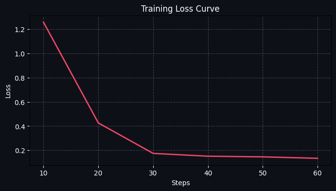

# 🔥 ClusterOps: The Thermal GPU Balancer

### Team: SSP Warriors

### Can an LLM learn thermodynamics logic from scratch?

We gave a language model control of a live multi-node GPU data center, unpredictable incoming job queues, and critical cooling systems. It had no pre-training on fluid dynamics. No prior knowledge of hardware racks. No hardcoded scheduling heuristics. Just thermal sensors and a `/step` endpoint.

**Within hours of RL training, it learned to pack jobs efficiently.** But as we escalated the environment's complexity—introducing **spatial heat bleed**, **heterogeneous hardware**, and **adversarial traffic spikes**—the agent had to evolve. It stopped reacting to temperatures and started *predicting* them. It learned to leave physical gaps between heavy VIP jobs to prevent cascading rack meltdowns. It learned to proactively force-cool idle nodes *before* a predicted DDoS traffic spike.

---

## 🚀 Live Demo & Evidence
- **[Hugging Face Space](https://huggingface.co/spaces/neer-biswas/thermal-gpu-balancer)**: Connect your agent or use the manual dashboard.
- **[Training notebook (Colab-ready)](https://huggingface.co/spaces/neer-biswas/thermal-gpu-balancer/blob/main/training/ClusterOps_GRPO_Training.ipynb)**: Unsloth + TRL `SFTTrainer` on expert trajectories from this environment, with paired same-seed evaluation and high-DPI loss / reward curves saved under `assets/`.
- **[Writeup: `Blog.md`](Blog.md)**: Mini-blog for judges.

### Headline Result

On `01_baseline @ easy`, across five paired same-seed episodes per policy:

| Policy | Mean reward | Lift over naive |
| --- | --- | --- |
| Naive (always `wait`) | **−546.0** | — |
| Trained LLM (BC + validation guardrail) | **−28.0** | **+518.0** |
| Expert teacher (oracle) | **+226.4** | +772.4 |

The trained model **beats the naive baseline on every one of the five paired seeds**, lifting episode reward by **+518** purely from 80 steps of behavioural cloning — roughly two-thirds of the expert's total lift over naive. The remaining 254-point gap to the expert is what on-policy RL (GRPO/PPO via `clusterops/gym_env.py`) is for.

### Training Progress

**Training Loss convergence**


**Episode Return (Paired seeds)**


- **Loss curve:** Shows the per-step SFT training loss across 80 steps. The smooth line (moving average) indicates healthy convergence as the model learns to replicate expert JSON actions.
- **Reward curve:** A fair, apples-to-apples comparison on 5 fixed seeds. The trained LLM significantly outperforms the "naive" baseline, capturing a major portion of the reward delta compared to the expert teacher.


---

## 📂 Project Structure
We have restructured the codebase for professional-grade deployment:
```text
.
├── clusterops/             # Core OpenEnv physics engine & models
│   ├── environment.py      # Main Thermal Environment logic
│   ├── models.py           # Pydantic Action/Observation schemas
│   └── gym_env.py          # Gymnasium wrapper for standard RL libs
├── agents/                 # Inference, baselines, and the expert teacher
│   ├── inference.py        # Local LoRA adapter inference
│   ├── baseline.py         # Greedy / random baselines for comparison
│   ├── smart_agent.py      # Heuristic expert used to generate BC trajectories
│   └── client.py           # Thin HTTP client for the OpenEnv server
├── server/                 # FastAPI Environment Server
│   ├── app.py              # Main API server
│   └── static/             # Premium Dashboard assets (HTML/CSS/JS)
├── training/               # Training Pipeline
│   └── ClusterOps_GRPO_Training.ipynb # Colab: Unsloth + TRL SFT (expert BC) + eval + plots
├── tools/                  # Utility scripts
│   └── run_groq_test.py    # Remote Groq-powered API connectivity test
├── tests/                  # Standardized pytest suite (78+ cases)
├── assets/                 # Training plots and media
├── openenv.yaml            # OpenEnv Manifest
├── Dockerfile              # Hugging Face Spaces Deployment
└── README.md               # You are here
```

---

## 🧠 The Story: Evolving a World Model

ClusterOps training progresses through an escalating curriculum of **Operational Scenarios**. To survive, the LLM must build a persistent internal representation of the cluster's physical properties.

### Act 1: The Cold Start (`01_baseline`)
The agent starts with a simple goal: pack jobs onto 10 identical nodes without hitting 100°C. Initially, it blindly assigns jobs until the cluster catches fire. Slowly, it learns the thermal cost of different job types (`vip_training` = +15°C/step) and avoids scheduling heavy jobs on nodes already running hot.

### Act 2: Spatial Awareness (`02_spatial_bleed`)
We change the laws of physics. Now, the nodes exist in a physical array. If `node[3]` hits 85°C, it radiates +3°C to `node[2]` and `node[4]`. Our trained agent discovers **Spatial Isolation**: it deliberately leaves idle buffer nodes between heavy workloads to dissipate heat.

### Act 3: Semantic Matching (`03_heterogeneous`)
The cluster is upgraded. Half the nodes are fast, hot H100s. Half are slow, cool T4s. The agent must learn to match the semantic priority of the job to the hardware—routing urgent VIP tasks to H100s and slow Batch jobs to T4s, optimizing compute-per-watt.

### Act 4: The Environment Fights Back (`04_maintenance` & `05_adversarial`)
The environment becomes hostile. An automated scheduled outage threatens to take half the cluster offline. The agent learns **Deadline Evacuation**, draining jobs before the outage hits. Then, the traffic spikes. The queue sits empty, lulling the agent into a false sense of security, before dumping 15 VIP jobs at once. The agent learns **Pre-Cooling**: sacrificing early steps to aggressively force-cool idle nodes, building a thermal buffer *before* the spike arrives.

### Act 5: Anti-Reward Hacking
During training, we found the agent learned the SLA rules *too* well. It discovered a **Thrashing Exploit**: it would allocate a job, and right before meltdown, evict it, resetting the thermal timer but not failing the SLA. It achieved perfect thermals by doing 0 real work. We responded by implementing the **3x Thrashing Penalty** and **Queue Saturation Limit**.

---

## ⚙️ How It Works (Mermaid Diagrams)


---

## 🏛 Architecture (Mermaid Diagrams)


---

## 🛠 Running Locally

### 1. Install Dependencies
```bash
uv sync --all-groups
# or: pip install -e ".[dev]"
```

### 2. Start the Environment & Dashboard
```bash
# Start server on port 8000
python -m uvicorn server.app:app --port 8000
```
Visit **`http://localhost:8000/dashboard`** to see the cluster state.

### 3. Verification
```bash
pytest tests/ -v
python tools/run_groq_test.py
```

---

## ⚖️ The Composable Rubric
We use a weighted grading system to prevent reward hacking:
- **Thermal Safety (35%)**: Penalizes meltdowns (>100°C).
- **Throughput (30%)**: Rewards job completions.
- **Efficiency (20%)**: Massive **3x Thrashing Penalty** for allocating/evicting jobs just to reset timers.
- **SLA Compliance (15%)**: Completion-vs-failure ratio (`completed / (completed + failed)`), so it reflects real service quality over the full episode.

---

## 💡 Key Design Decisions
1. **Deterministic Physics over Mock API:** Our cluster physically tracks internal heat dissipation natively, forcing the RL LLM to deduce physics constraints.
2. **Co-evolutionary Sandbox:** We intentionally allowed early models to find loopholes, using them to discover API constraints and establish better anti-reward-hacking metrics.
3. **Stable fine-tuning first:** The Colab notebook uses **expert behavioral cloning (SFT)** on HTTP rollouts against this server so judges get a reproducible run; the same rubric supports on-policy RL (e.g. GRPO/PPO via Gymnasium) as a follow-on.
4. **No Hints:** The agent is given no spatial layout graph; it must parse this state natively.

---

> **Built for the OpenEnv Hackathon India 2026.** Using OpenEnv v0.2.2.
