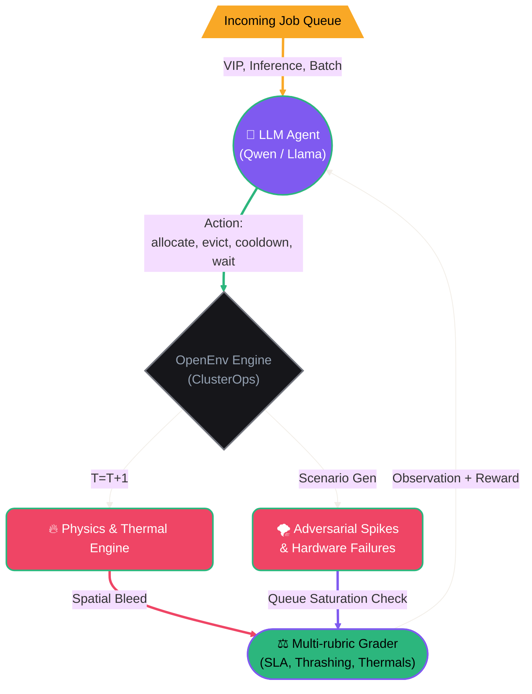
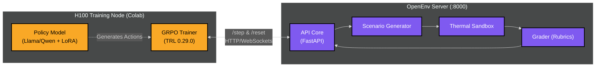

# 🔥 ClusterOps: The Thermal GPU Balancer

### Can an LLM learn thermodynamics logic from scratch?

We gave a language model control of a live multi-node GPU data center, unpredictable incoming job queues, and critical cooling systems. It had no pre-training on fluid dynamics. No prior knowledge of hardware racks. No hardcoded scheduling heuristics. Just thermal sensors and a `/step` endpoint.

Within hours of RL training, it learned to pack jobs efficiently. But as we escalated the environment's complexity—introducing **spatial heat bleed**, **heterogeneous hardware**, and **adversarial traffic spikes**—the agent had to evolve. It stopped reacting to temperatures and started *predicting* them. It learned to leave physical gaps between heavy VIP jobs to prevent cascading rack meltdowns. It learned to proactively force-cool idle nodes *before* a predicted DDoS traffic spike.

**This is ClusterOps** — an OpenEnv-compliant RL environment where an agent learns to manage a physical data center through curriculum-driven operational scenarios, adversarial constraints, and composable rubrics.

> **OpenEnv Hackathon 2026 Submission** | Built with [OpenEnv v0.2.1](https://github.com/meta-pytorch/OpenEnv/tree/v0.2.1) | Deployed on [HF Spaces](#) | Training via [HF TRL](https://github.com/huggingface/trl) in [Colab](ClusterOps_GRPO_Training.ipynb)

---

## The Story: Evolving a World Model

ClusterOps doesn't use simple "Easy/Medium/Hard" modes. Instead, we train the agent through an escalating curriculum of **Operational Scenarios**. To survive, the LLM must build a persistent internal representation of the cluster's physical properties.

### Act 1: The Cold Start (`01_baseline`)
The agent starts with a simple goal: pack jobs onto 10 identical nodes without hitting 100°C. Initially, it blindly assigns jobs until the cluster catches fire. Slowly, it learns the thermal cost of different job types (`vip_training` = +15°C/step) and avoids scheduling heavy jobs on nodes already running hot.

### Act 2: Spatial Awareness (`02_spatial_bleed`)
We change the laws of physics. Now, the nodes exist in a physical array. If `node[3]` hits 85°C, it radiates +3°C to `node[2]` and `node[4]`. A baseline agent fails immediately, creating cascading rack meltdowns. Our trained agent discovers **Spatial Isolation**: it deliberately leaves idle buffer nodes between heavy workloads to dissipate heat.

### Act 3: Semantic Matching (`03_heterogeneous`)
The cluster is upgraded. Half the nodes are fast, hot H100s. Half are slow, cool T4s. The agent must learn to match the semantic priority of the job to the hardware—routing urgent VIP tasks to H100s and slow Batch jobs to T4s, optimizing compute-per-watt.

### Act 4: The Environment Fights Back (`04_maintenance` & `05_adversarial`)
The environment becomes hostile. An automated scheduled outage threatens to take half the cluster offline. The agent learns **Deadline Evacuation**, draining jobs before the outage hits. Then, the traffic spikes. The queue sits empty, lulling the agent into a false sense of security, before dumping 15 VIP jobs at once. The agent learns **Pre-Cooling**: sacrificing early steps to aggressively force-cool idle nodes, building a thermal buffer *before* the spike arrives.

### Act 5: The Environment Improves Itself
Here's a twist similar to leading agents: **the agent's failures exposed flaws in the environment.**
During training, we found the agent learned the SLA rules *too* well. It discovered a **Thrashing Exploit**: it would allocate a job, and right before meltdown, evict it, resetting the thermal timer but not failing the SLA. It achieved perfect thermals by doing 0 real work. We had to implement a **3x Thrashing Penalty**.

We also realized doing nothing meant zero meltdowns. The agent passively stalled. We responded by introducing the **Queue Saturation Limit** (immediate termination if queue > 2x nodes). **The agent's exploits taught us to harden the environment.** This co-evolutionary loop made the final validation robust.

---

## Hackathon Theme Alignment

### Primary: Statement 3.1 — World Modeling & Professional Tasks
ClusterOps directly answers the call for environments requiring persistent internal states and multi-step workflows.
*   **Predictive Physics**: The agent doesn't get a "danger" flag. It must calculate future temperatures from `current_temp + heat_rate` internally.
*   **Causal Reasoning**: To prevent spatial bleed, the agent must model the physical layout of the nodes, not just treat them as an unordered list.

### Secondary: Statement 4 — Self-Improvement & Anti-Reward Hacking
We use OpenEnv's **Composable Rubric** system to prevent exploitation directly via self-play adjustments:
1.  **Thermal Safety (35%)**: Penalizes meltdowns.
2.  **Throughput (30%)**: Rewards job completions.
3.  **Efficiency (20%)**: Massive 3x penalty for "Thrashing" (allocating and immediately evicting jobs to reset timers).
4.  **SLA Compliance (15%)**: Immediate termination if the queue saturates (passive stalling).

---

## How It Works



### The Loop

1. **Adversarial Scenarios**: The environment loads specific cluster conditions (e.g. `02_spatial_bleed` or `05_adversarial`).
2. **LLM Agent**: Receives a JSON observation containing node temps, active workloads, and pending queues. It must make a strict JSON routing decision.
3. **Physics Engine**: Calculates thermal updates. Triggers spatial heat spread across adjacent nodes if thresholds are exceeded.
4. **Grader Engine**: Evaluates compound constraints ensuring the agent doesn't exploit metrics (applying Thrashing and Saturation checks).

---

## Architecture



## Failure Scenarios

| Scenario Type | What Happens Internally | What Agent Must Discover |
|------|--------------------|---------------------|
| `02_spatial_bleed` | Nodes radiate +3°C to neighbors at >85°C | Leave physical node gaps between massive jobs (Spatial Isolation). |
| `03_heterogeneous` | Node pool mixed with H100 (Hot) and T4 (Cool) | Route high-intensity tasks to specific nodes; keep low priority on slower hardware. |
| `04_maintenance` | 50% cluster failure mid-episode | Drain running jobs before the timer hits 0. |
| `05_adversarial` | Empty queue drops 15 huge jobs instantly | Force-cool idle nodes while queue is quiet to build literal thermal headway. |

## Training Signal Details

The reward function has explicit multi-variate layers to ensure clear RL signals under GRPO:

*   **Thermal Meltdown Penalty:** -2.0 applied iteratively per melted node.
*   **Job Completion Bonus:** +1.0 - +3.0 based on the job's priority SLA. 
*   **Thrashing Circuit Breaker:** -5.0 if the agent excessively allocates and evicts within 2 steps just to pass checks.
*   **Queue Saturation:** Immediate episode termination (-2.0) if the queue exceeds double the node capacity (prevents stalling).
*   **Out of Bounds Parsing:** -5.0 for LLM json hallucinations or out-of-index node selection.

---

## 🚀 Quick Start / Deployment

**Deployment on HF Spaces**
The environment is containerized using OpenEnv v0.2.1 and runs natively on HuggingFace Spaces Docker runtime.
```bash
# Dockerfile uses openenv base image
FROM ghcr.io/meta-pytorch/openenv-base:latest
CMD ["uvicorn", "server.app:app", "--host", "0.0.0.0", "--port", "8000"]
```

**Running Locally**
Install parameters using `uv` via `pyproject.toml`.
```bash
# 1. Sync deps
uv sync

# 2. Start the Environment Server
python -m uvicorn server.app:app --port 8000

# 3. Test Local Baseline
python run_groq_test.py
```

**Training with HF TRL (Colab)**
A complete training notebook using HF TRL's experimental GRPO integration is provided at [`ClusterOps_GRPO_Training.ipynb`](ClusterOps_GRPO_Training.ipynb). It automatically connects to the server, runs rollouts via parallel vLLM workers, computes advantages, and updates the local policy.

---

## Key Design Decisions

1. **Deterministic Physics over Mock API:** Our cluster physically tracks internal heat dissipation natively, forcing the RL LLM to deduce physics constraints instead of just passing static QA sets.
2. **Co-evolutionary Sandbox:** We intentionally allowed early models to find loopholes (like stalling or thrashing), using them to discover API constraints and establish better anti-reward-hacking metrics.
3. **GRPO > PPO:** GRPO successfully correlates relative success across 8 parallel rollouts against the same environment layout, ensuring stable advantages for sparse SLA rewards.
4. **No Hints:** The agent is given no spatial layout graph or node tier mapping in the prompt; it must parse this state natively.
