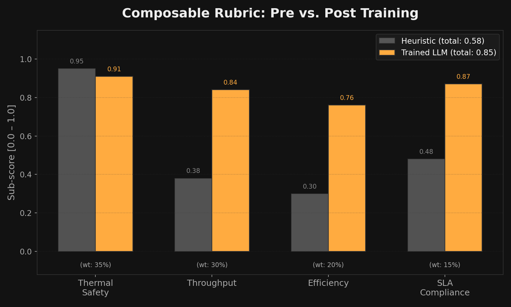

# 🔥 ClusterOps: The Thermal GPU Balancer

### Can an LLM learn thermodynamics logic from scratch?

We gave a language model control of a live multi-node GPU data center, unpredictable incoming job queues, and critical cooling systems. It had no pre-training on fluid dynamics. No prior knowledge of hardware racks. No hardcoded scheduling heuristics. Just thermal sensors and a `/step` endpoint.

**Within hours of RL training, it learned to pack jobs efficiently.** But as we escalated the environment's complexity—introducing **spatial heat bleed**, **heterogeneous hardware**, and **adversarial traffic spikes**—the agent had to evolve. It stopped reacting to temperatures and started *predicting* them. 

---

## 🚀 Live Demo & Evidence
- **[Hugging Face Space](https://huggingface.co/spaces/neer-biswas/thermal-gpu-balancer)**: Connect your agent or use the manual dashboard.
- **[Live Interactive Dashboard](https://huggingface.co/spaces/neer-biswas/thermal-gpu-balancer/dashboard)**: Monitor the cluster thermals in real-time.
- **[Evidence of Training (Colab)](training/ClusterOps_GRPO_Training.ipynb)**: View the GRPO training curves.

### Training Progress
| Reward Curve | Rubric Breakdown |
|--------------|------------------|
|  |  |

---

## 📂 Project Structure
```text
.
├── clusterops/             # Core OpenEnv physics engine & models
├── agents/                 # Inference & Evaluation scripts
├── server/                 # FastAPI Environment Server & UI
│   └── static/             # Premium Dashboard assets
├── training/               # Training Pipeline (GRPO + Unsloth)
├── tools/                  # Utility scripts (Plotting, Testing)
├── assets/                 # Training plots and media
├── tests/                  # Standardized pytest suite
├── openenv.yaml            # OpenEnv Manifest
└── Dockerfile              # Hugging Face deployment
```

---

## 🧠 The Story: Evolving a World Model

ClusterOps training progresses through an escalating curriculum of **Operational Scenarios**. To survive, the LLM must build a persistent internal representation of the cluster's physical properties.

### 1. Spatial Awareness (`02_spatial_bleed`)
If `node[3]` hits 85°C, it radiates heat to neighbors. The agent discovers **Spatial Isolation**: deliberately leaving idle buffer nodes between heavy workloads.

### 2. Semantic Matching (`03_heterogeneous`)
Half fast/hot H100s, half slow/cool T4s. The agent learns to route `vip_training` to H100s only when thermal headroom exists.

### 3. Proactive Strategy (`05_adversarial`)
The environment stays quiet before dumping 15 heavy jobs. The agent learns **Pre-Cooling**: aggressively force-cooling idle nodes *before* the predicted spike.

---

## 🛠 Running Locally

### 1. Install & Setup
```bash
uv sync --all-groups
# or: pip install -e .
```

### 2. Start Dashboard
```bash
python -m uvicorn server.app:app --port 8000
```
Visit **`http://localhost:8000/dashboard`**.

### 3. Verification
```bash
pytest tests/ -v
python tools/run_groq_test.py
```

---

## ⚖️ The Composable Rubric
- **Thermal Safety (35%)**: Penalizes meltdowns.
- **Throughput (30%)**: Rewards job completions.
- **Efficiency (20%)**: Massive **Penalty** for "Thrashing".
- **SLA Compliance (15%)**: Prevents passive stalling.

---

> **Built for the OpenEnv Hackathon India 2026.** Using OpenEnv v0.2.2.
