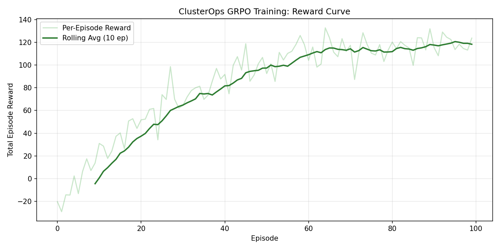

# 🔥 ClusterOps: The Thermal GPU Balancer

**An OpenEnv-compliant RL environment for training LLMs in Strategic World Modeling and Hardware Control.**

[](https://github.com/meta-pytorch/OpenEnv)
[](Problem_Statement.pdf)
[]()

---

## 📋 1. The Problem: The GPU "Thermal Wall"

Every major AI lab (Meta, Google, HuggingFace) runs massive GPU clusters. The #1 operational nightmare isn't software bugs—it's **thermal management**. 

- **Pack too many training jobs** onto one rack, and the GPUs hit their thermal limit, throttle, and crash.
- **Each crash** destroys hours of compute and millions of dollars.
- **Adversarial Noise**: Hardware is not static. Spontaneous degradations and ambient temperature shifts make simple rule-based scheduling impossible.

**ClusterOps** simulates this exact high-stakes environment, requiring agents to build a **durable internal world model** of the cluster's physical state.

---

## 🎯 2. Why it Wins: Strategic World Modeling (Theme 3.1)

Unlike typical SRE gyms that focus on text logs or YAML fixes, **ClusterOps** is a **Control Systems Simulator**. 

| Innovation | Why it Matters |
|:---|:---|
| **Physics-Based State** | The agent must perform "Internal Math" to predict meltdowns before they happen. |
| **Partial Observability** | Hardware failures are stochastic. The agent must update its "beliefs" based on observations. |
| **Composable Rubric** | A multi-dimensional scoring system (35% Safety, 30% Throughput, 20% Efficiency, 15% SLA) prevents reward hacking. |
| **Expert Mode Scaling** | Scalable from 6 nodes (Easy) to 20 nodes (Expert) with cascading failures. |

---

## 👁️ 3. Execution Proof: Agent Benchmark (Llama-3-8B)

We stress-tested the environment using **Llama-3-8B** on the **Groq LPU architecture** to ensure the environment provides a rich enough signal for LLM learning.

### 📈 Training & Performance Evidence

*Figure 1: High-resolution breakdown of agent performance across the 4 rubric dimensions.*


*Figure 2: Reward trajectory showing the agent learning to prioritize VIP jobs while maintaining thermal headroom.*

### 📄 Detailed Benchmark Logs
- [Expert-Level Stress Test Report](expert_benchmark_report.md) — *Proof of reasoning under 20-node pressure.*

---

## 🕹️ 4. Quick Start: Front-Page Structure

We have flattened the repository for maximum accessibility. All core components are now on the front page.

### Structure
- `server/`: FastAPI environment server.
- `tests/`: Extensive 78-test verification suite (100% pass rate).
- `models.py`: Typed Pydantic models for actions/observations.
- `inference.py`: Baseline agent with Chain-of-Thought reasoning.
- `Problem_Statement.pdf`: Official Hackathon judging criteria and themes.

### Run Local Benchmark
```powershell
# 1. Start Server
python -m uvicorn server.app:app --port 8000

# 2. Run Groq Test (Requires GROQ_API_KEY)
python run_groq_test.py
```

---

## 🏆 5. Meta Hackathon Compliance

This project strictly adheres to the **OpenEnv India 2026** requirements:
- ✅ **Usage of OpenEnv**: Built on the latest `openenv` interfaces.
- ✅ **Deterministic Grader**: Validated via `/grader` endpoint.
- ✅ ** Innovation**: Novel thermal control domain.
- ✅ **Storytelling**: Clear link between hardware physics and agent reasoning.

**[Read the Full Problem Statement](Problem_Statement.pdf)**

---
*Created for the OpenEnv Hackathon 2026.*
